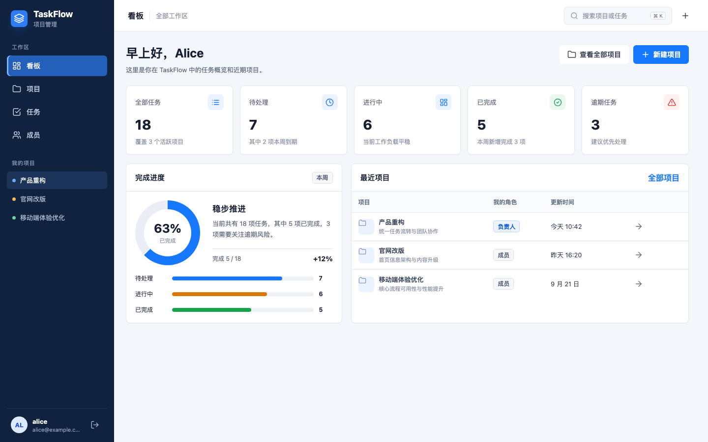
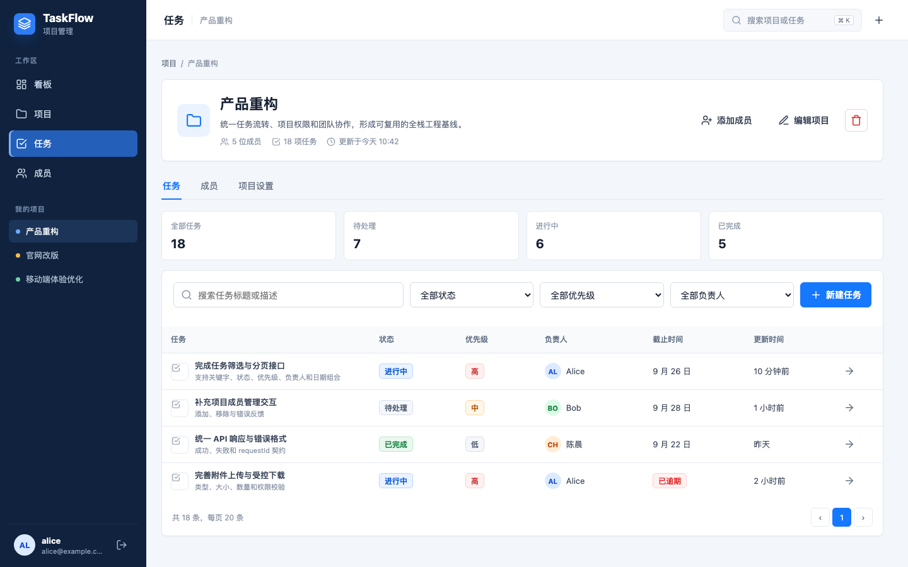
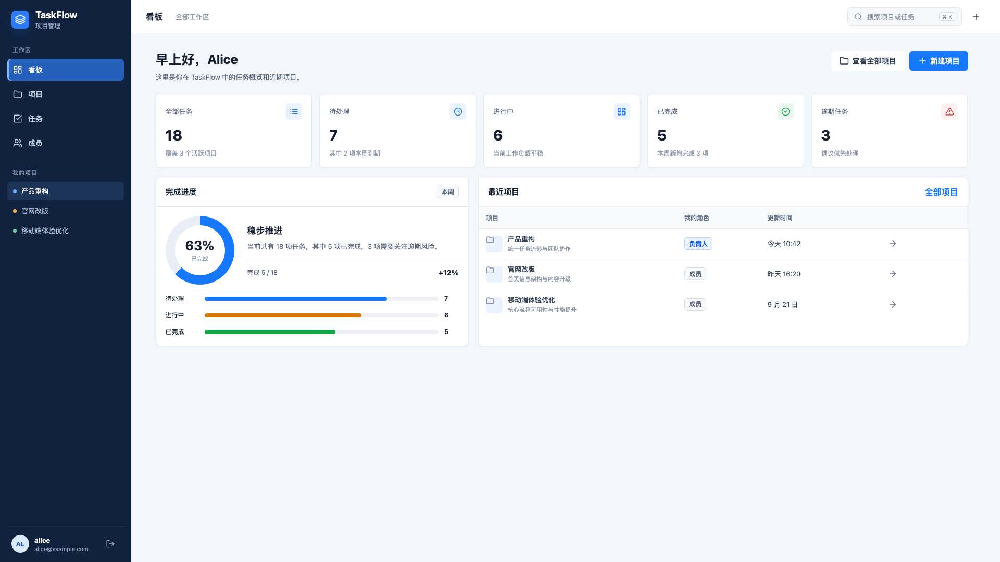
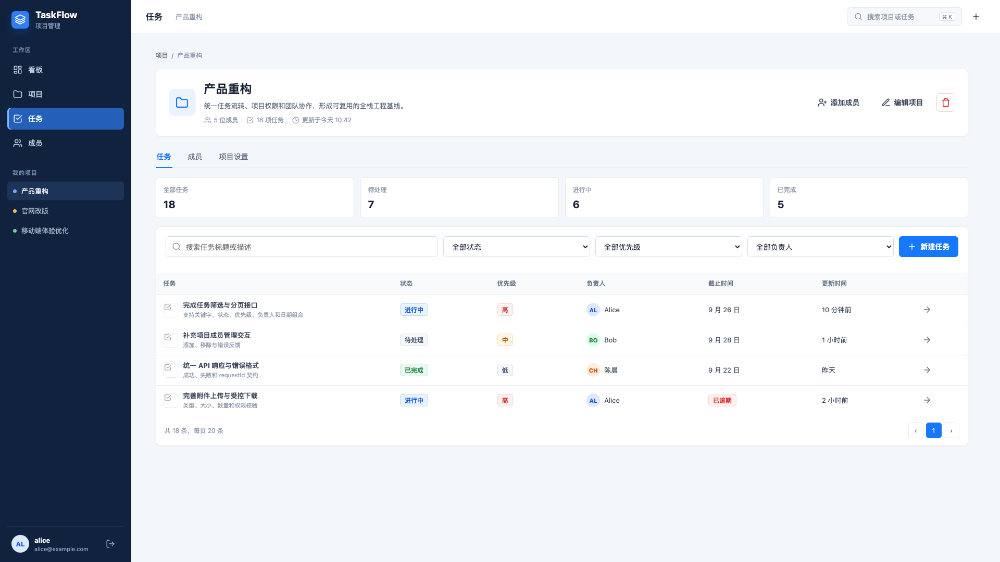

# TaskFlow 产品原型

## 可交互原型

直接用浏览器打开 [taskflow-prototype.html](./prototypes/taskflow-prototype.html)。

原型包含以下可切换视图：

- 登录
- 看板
- 项目列表
- 项目详情与任务列表
- 项目成员
- 项目设置
- 任务详情

可交互行为包括：

- 登录、退出和页面导航。
- `任务`和`成员`使用独立激活状态并切换到对应标签页。
- “我的项目”列表会切换项目名称、描述、面包屑和激活状态。
- 项目与任务搜索。
- 项目角色筛选。
- 任务状态和优先级筛选。
- 项目、任务和成员表单弹窗。
- 任务详情跳转。
- 评论发布反馈和附件操作反馈。

原型只使用 HTML、CSS 和原生 JavaScript，不依赖外部网络资源。布局、主色、间距、状态色和组件密度按 Vue 3 + Element Plus 的桌面端实现方式设计，便于后续拆分：

- `AppLayout`
- `DashboardView`
- `ProjectsView`
- `ProjectDetailView`
- `TaskDetailView`
- `ProjectFormDialog`
- `MemberPanel`
- `TaskFilters`
- `TaskTable`
- `TaskFormDialog`
- `CommentList`
- `AttachmentPanel`

## 桌面截图

### 1440 x 900

### 1920 x 1080

## 布局检查

- 截图由 Chromium 无头模式按真实视口生成。
- 已检查看板、项目详情和任务详情。
- 两种视口下文档宽度不超过视口宽度。
- 主内容区没有横向滚动。
- 卡片、统计块、按钮和标签没有检测到非预期重叠。
